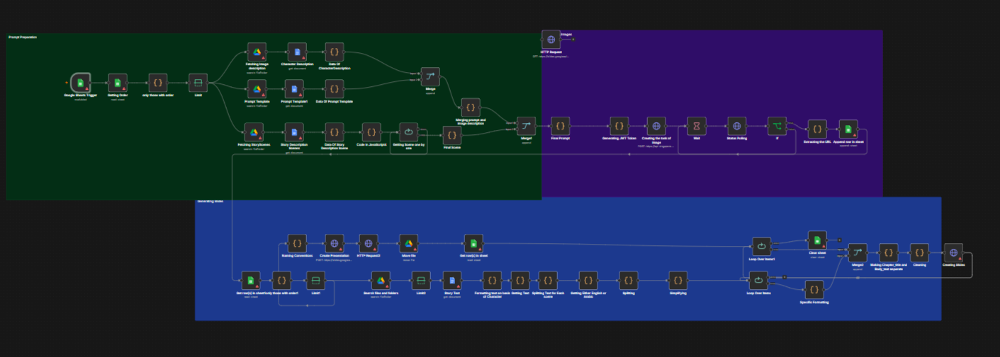
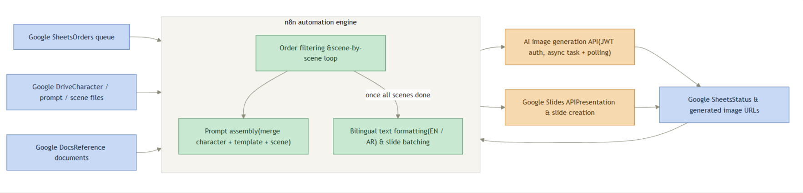
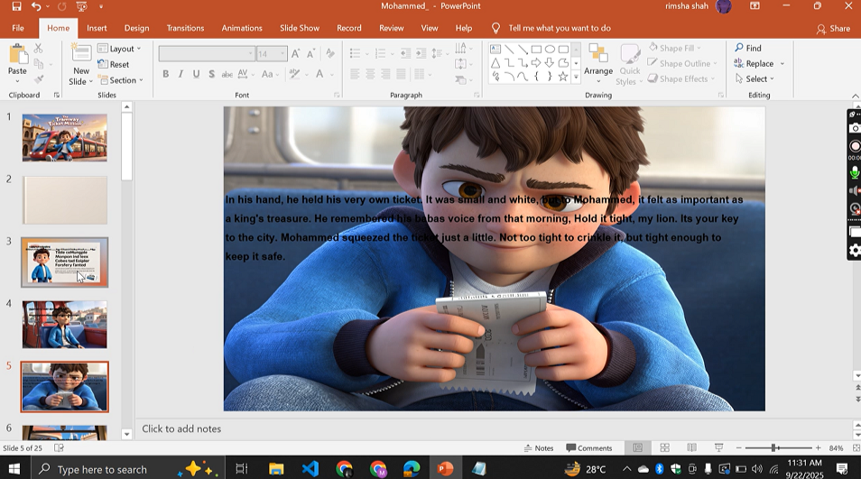

# AI Storybook Generator

## Overview

AI Storybook Generator is an end-to-end automation workflow built using n8n and Large Language Models (LLMs). The system transforms a simple Google Sheets entry containing a character name and story description into a complete illustrated storybook.

The workflow automatically generates a structured story, creates AI-generated illustrations for every scene, uploads the assets to Google Drive, and assembles a professional slide-by-slide storybook without manual intervention.

## Problem

Creating illustrated children's storybooks manually requires significant time for writing, designing, and formatting. Businesses and content creators often need a faster and more scalable solution.

## Solution

This automation pipeline eliminates manual work by combining workflow automation, AI text generation, image generation, and presentation automation into a single end-to-end process.

A single Google Sheets entry automatically triggers the complete workflow and produces a ready-to-use illustrated storybook within minutes.

## Features

- Automated workflow using n8n
- Story generation with LLMs
- Structured scene generation
- AI illustration generation
- Google Drive integration
- Automatic Google Slides creation
- End-to-end workflow automation

  Google Sheets

↓

n8n Trigger

↓

Story Generation (LLM)

↓

Scene Extraction

↓

AI Image Generation

↓

Upload Images

↓

Create Google Slides

↓

Final Storybook

## Tech Stack

### Automation
- n8n

### AI
- OpenAI
- LLMs

### Programming
- Python

### Integrations
- Google Sheets API
- Google Drive API
- Google Slides API

### Image Generation
- Kling AI

## Screenshots

### Workflow Overview

### Architecture

### Generated Storybook

